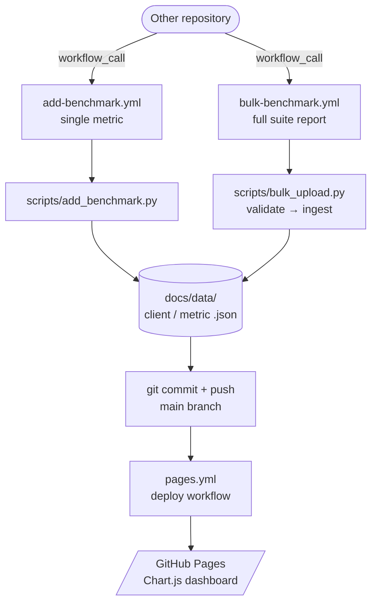

# CenySlovensko Benchmarks

Historical performance tracking for CenySlovensko services, published via GitHub Pages.

**Live charts →** `https://cenyslovensko-api.github.io/benchmarks/`

## How it works



## Submitting benchmarks from another repository

### 1. Configure GitHub App auth

Use the GitHub App owned by `@cenyslovensko-api` (App ID `4640297`) and store its private key in the calling repository
as a secret (e.g. `BENCHMARKS_GITHUB_APP_PRIVATE_KEY`).  
The reusable workflows mint an installation token internally.

---

### Option A — Single metric (`add-benchmark.yml`)

Use this when you want to record one metric at a time inline in your workflow.

```yaml
jobs:
  run-and-record:
    runs-on: ubuntu-latest
    steps:
      - name: Run your benchmark
        id: bench
        run: |
          RESULT=$(your-benchmark-command)
          echo "value=$RESULT" >> "$GITHUB_OUTPUT"

      - name: Record to CenySlovensko Benchmarks
        uses: cenyslovensko-api/benchmarks/.github/workflows/add-benchmark.yml@main
        with:
          github_app_id: "4640297"             # optional, defaults to 4640297
          client: python                      # python | go | rust | …
          benchmark_name: api_response_time
          value: ${{ steps.bench.outputs.value }}
          unit: ms
          repository: ${{ github.repository }}
          commit_sha: ${{ github.sha }}
        secrets:
          github_app_private_key: ${{ secrets.BENCHMARKS_GITHUB_APP_PRIVATE_KEY }}
```

#### Inputs

| Input            | Required | Description                                  |
|------------------|----------|----------------------------------------------|
| `github_app_id`  | —        | GitHub App ID (defaults to `4640297`)        |
| `client`         | ✅       | Client/app name, e.g. `python`, `go`, `rust` |
| `benchmark_name` | ✅       | Metric identifier within that client         |
| `value`          | ✅       | Numeric result                               |
| `unit`           | ✅       | Unit label, e.g. `ms`, `req/s`, `MB`         |
| `repository`     | —        | Source repo (`${{ github.repository }}`)     |
| `commit_sha`     | —        | Source commit (`${{ github.sha }}`)          |

---

### Option B — Full suite report (`bulk-benchmark.yml`) ✨ recommended

Run your entire benchmark suite, produce a JSON report, then submit everything in **one push**. The report must conform
to [`schemas/benchmark-report.schema.json`](schemas/benchmark-report.schema.json).

```yaml
jobs:
  benchmark:
    runs-on: ubuntu-latest
    outputs:
      report: ${{ steps.run.outputs.report }}
    steps:
      - uses: actions/checkout@v4

      - name: Run full benchmark suite
        id: run
        run: |
          # Produce a benchmark-report.json conforming to the schema, then capture it.
          python run_benchmarks.py > benchmark-report.json
          echo "report=$(cat benchmark-report.json)" >> "$GITHUB_OUTPUT"

  upload:
    needs: benchmark
    uses: cenyslovensko-api/benchmarks/.github/workflows/bulk-benchmark.yml@main
    with:
      github_app_id: "4640297" # optional, defaults to 4640297
      report_json: ${{ needs.benchmark.outputs.report }}
    secrets:
      github_app_private_key: ${{ secrets.BENCHMARKS_GITHUB_APP_PRIVATE_KEY }}
```

#### Report format

```json
{
  "client": "python",
  "repository": "my-org/my-repo",
  "commit": "abc1234",
  "benchmarks": [
    {
      "name": "api_latency_p50",
      "value": 42.5,
      "unit": "ms"
    },
    {
      "name": "api_latency_p99",
      "value": 98.1,
      "unit": "ms"
    },
    {
      "name": "throughput",
      "value": 1250,
      "unit": "req/s"
    },
    {
      "name": "memory_usage",
      "value": 128.4,
      "unit": "MB"
    }
  ]
}
```

Full JSON Schema: [`schemas/benchmark-report.schema.json`](schemas/benchmark-report.schema.json)

#### Inputs

| Input           | Required | Description                                 |
|-----------------|----------|---------------------------------------------|
| `github_app_id` | —        | GitHub App ID (defaults to `4640297`)       |
| `report_json`   | ✅       | Inline JSON string matching the schema      |
| `validate_only` | —        | `true` = dry-run (validate without writing) |

---

### Secret (both workflows)

| Secret                   | Description                            |
|--------------------------|----------------------------------------|
| `github_app_private_key` | GitHub App private key (PEM format)    |

---

## Running scripts locally

**Single metric:**

```bash
python scripts/add_benchmark.py \
  --client python \
  --benchmark api_latency_p50 \
  --value 42.5 --unit ms \
  --repository my-org/my-repo --commit abc1234
```

**Bulk upload from file:**

```bash
python scripts/bulk_upload.py benchmark-report.json
```

**Bulk upload from stdin:**

```bash
cat benchmark-report.json | python scripts/bulk_upload.py --stdin
```

**Validate only (dry-run):**

```bash
python scripts/bulk_upload.py benchmark-report.json --validate-only
```

## Data layout

```
docs/data/
  index.json                        ← {"clients": ["go", "python", "rust"]}
  python/
    index.json                      ← {"benchmarks": ["api_latency_p50", "throughput", ...]}
    api_latency_p50.json            ← entries for this metric
    throughput.json
  go/
    index.json
    ...
schemas/
  benchmark-report.schema.json      ← JSON Schema for bulk report format
```

The page loads in 3 parallel stages:

1. `data/index.json` → client list
2. `Promise.all` → all `data/<client>/index.json`
3. `Promise.all` → all metric files across every client

### Per-metric file (`docs/data/<client>/<benchmark>.json`)

```json
{
  "name": "api_latency_p50",
  "client": "python",
  "entries": [
    {
      "timestamp": "2024-01-15T10:30:00Z",
      "value": 42.5,
      "unit": "ms",
      "repository": "my-org/my-repo",
      "commit": "abc1234"
    }
  ]
}
```

## GitHub Pages setup

In repository **Settings → Pages → Source: GitHub Actions**. The page redeploys automatically on every push to `main`
that touches `docs/`.
